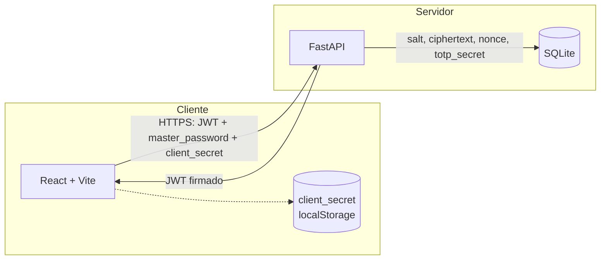
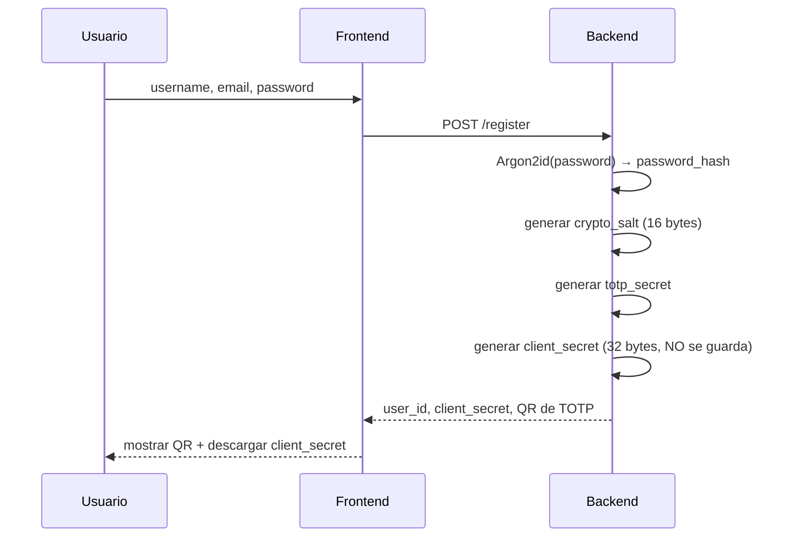
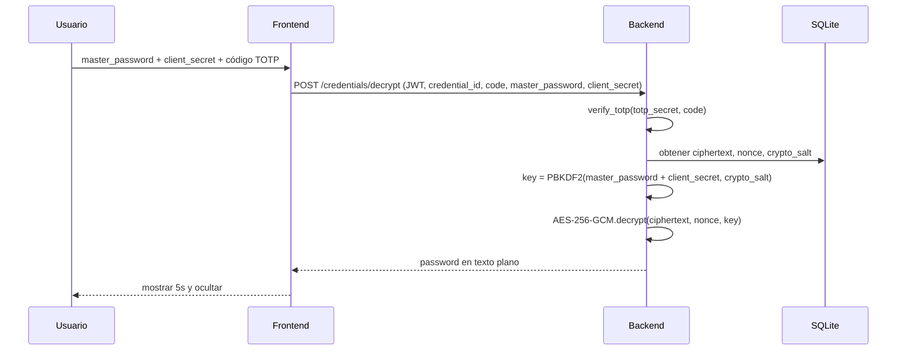

# 🔐 Password Vault

Gestor de contraseñas seguro desarrollado como proyecto del curso de Criptografía. Implementa cifrado autenticado, derivación de llaves con un secreto de cliente, y autenticación multifactor con TOTP.

## Descripción del sistema

Password Vault permite a un usuario almacenar credenciales de servicios de terceros (usuario + contraseña) de forma cifrada. Ninguna contraseña se guarda jamás en texto plano: la llave de cifrado se deriva de la contraseña maestra del usuario combinada con un **secreto de cliente** generado al registrarse, que el servidor entrega una sola vez y no conserva. Además, revelar una contraseña guardada requiere un segundo factor (TOTP).

## Arquitectura



- El **cliente** nunca persiste la contraseña maestra (solo vive en memoria durante la sesión) ni el secreto de cliente en el servidor.
- El **servidor** guarda por usuario: hash Argon2id de la contraseña de login, salt de cifrado, secreto TOTP, y por cada credencial: ciphertext + nonce. Nunca guarda el `client_secret`.

## Stack tecnológico

| Capa | Tecnología |
|---|---|
| Frontend | React + Vite, Axios, React Router |
| Backend | FastAPI, SQLAlchemy |
| Base de datos | SQLite |
| Autenticación de sesión | JWT (HS256) |

## Diseño criptográfico

| Propósito | Algoritmo | Librería | Justificación |
|---|---|---|---|
| Hash de contraseña de login | Argon2id | `argon2-cffi` | Ganador del Password Hashing Competition; resistente a ataques por GPU/ASIC, memory-hard. |
| Derivación de llave de cifrado | PBKDF2-HMAC-SHA256, 300,000 iteraciones | `cryptography` | Estándar aceptado (NIST SP 800-132); se combina `master_password + client_secret` como entrada, y el `crypto_salt` único por usuario como sal. |
| Cifrado de credenciales | AES-256-GCM | `cryptography` | Cifrado autenticado (AEAD): protege confidencialidad e integridad en una sola operación; nonce aleatorio de 96 bits, único por cada cifrado. |
| Segundo factor | TOTP (RFC 6238) | `pyotp` | Estándar de facto para 2FA compatible con Google Authenticator y apps similares. |
| Sesión | JWT firmado, expiración 30 min | `PyJWT` | Evita que los endpoints confíen en IDs enviados por el cliente (mitiga IDOR). |

**Por qué un secreto de cliente además de la contraseña maestra:** si solo se derivara la llave de la contraseña maestra, el servidor —con acceso a la base de datos— tendría todo lo necesario para reconstruir la llave de cifrado de cualquier usuario. Al introducir un segundo componente de alta entropía que **nunca se persiste en el servidor**, ni un volcado completo de la base de datos permite descifrar las credenciales sin también poseer ese secreto.

## Flujo criptográfico

### Registro


### Crear / revelar una credencial


## Funcionalidades

- [x] Registro y login de usuarios (Argon2id + JWT)
- [x] 2FA con TOTP (QR de vinculación con Google Authenticator)
- [x] Secreto de cliente generado al registro, entregado una sola vez
- [x] CRUD de credenciales (crear, editar, eliminar, listar)
- [x] Generador de contraseñas seguro (`crypto.getRandomValues`)
- [x] Búsqueda de credenciales por servicio/cuenta
- [x] Revelado de contraseñas protegido por TOTP + client_secret, con auto-ocultado
- [x] Autorización basada en JWT (endpoints ya no confían en IDs del cliente)

## Modelo de amenazas y limitaciones conocidas

| Amenaza | Mitigación implementada |
|---|---|
| Robo de base de datos | Contraseñas cifradas con AES-256-GCM; sin `client_secret` (no persistido) no se puede derivar la llave. |
| Acceso a credenciales de otro usuario (IDOR) | Todos los endpoints identifican al usuario vía JWT, no vía parámetros del cliente. |
| Fuerza bruta sobre contraseña maestra | Argon2id (login) + PBKDF2 300k iteraciones (cifrado) elevan el costo computacional por intento. |
| Reutilización de nonce en AES-GCM | Nonce aleatorio de 96 bits generado en cada operación de cifrado, incluida la edición. |
| Robo del código TOTP | Ventana de validez corta (30s estándar de RFC 6238); revelado de contraseña se oculta automáticamente a los 5s. |

**Limitaciones documentadas (no resueltas en esta entrega):**
- El servidor recibe `master_password` y `client_secret` en tránsito (no solo en reposo) para poder derivar la llave del lado del servidor. Un diseño verdaderamente *zero-knowledge* movería esa derivación y el cifrado/descifrado al navegador (Web Crypto API), quedando como trabajo futuro.
- No hay rate limiting en `/login` ni en la verificación TOTP — vulnerable a fuerza bruta online.
- No se fuerza HTTPS en el entorno de desarrollo (CORS restringido a `localhost` como mitigación parcial).
- Si el usuario pierde su `client_secret` sin haberlo respaldado, no existe mecanismo de recuperación de la bóveda (trade-off consciente de seguridad vs. usabilidad).

## Instalación

### Requisitos
- Node.js
- Python 3.11+
- Git

### Clonar
```bash
git clone https://github.com/diegorivadeneyra/password-manager.git
cd password-manager
```

### Backend
```bash
cd backend
python3 -m venv venv
source venv/bin/activate        # Windows: venv\Scripts\activate
pip install -r requirements.txt
uvicorn main:app --reload
```
Disponible en `http://127.0.0.1:8000` (docs interactivas en `/docs`).

### Frontend
```bash
cd frontend
npm install
npm run dev
```
Disponible en `http://localhost:5173`.

## Estructura del proyecto

```text
password-manager/
├── backend/
│   ├── main.py           # Endpoints FastAPI
│   ├── auth.py            # Hash de contraseñas, JWT
│   ├── crypto_utils.py     # Derivación de llave, AES-GCM
│   ├── totp_utils.py       # Generación/verificación TOTP
│   ├── models.py           # Modelos SQLAlchemy
│   ├── schemas.py          # Esquemas Pydantic
│   └── database.py
├── frontend/
│   └── src/
│       ├── pages/          # Home, Login, Register, Dashboard, About
│       ├── context/         # AuthContext (master password en memoria)
│       └── services/        # Cliente Axios con interceptor JWT
└── README.md
```

## Trabajo futuro

- Derivación de llave y cifrado/descifrado completamente en el cliente (Web Crypto API) para lograr *zero-knowledge* real.
- Rate limiting en autenticación.
- Análisis estático de seguridad automatizado (bandit) integrado en CI.
- Envío del `client_secret` por correo como alternativa a la descarga manual.